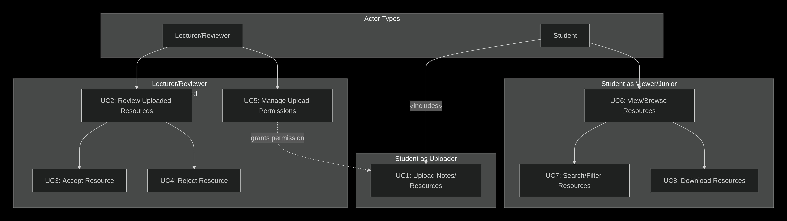
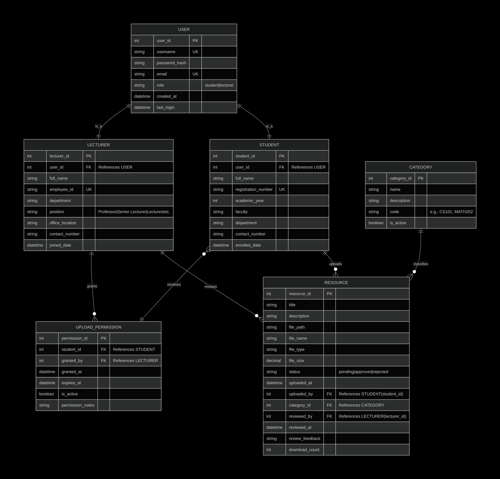

# University Resource App

A modern resource sharing platform for university students and lecturers.

---

## 📚 Project Overview

This application enables:
- Students to upload, browse, and download academic resources
- Lecturers to review and approve/reject resources
- Role-based dashboards and permissions
- Secure authentication and file management

---

## 📖 Use Case Diagram

---

## 🗂️ Entity Relationship (ER) Diagram

---

## 🏗️ Features
- User authentication (student/lecturer roles)
- Resource upload, download, and review workflows
- Category/tag-based resource organization
- Dashboard analytics for students and lecturers
- File storage and permission management
- REST API for frontend integration

---

## 💻 Frontend Wireframes
- `/frontend-wireframes/login.html` — Login page
- `/frontend-wireframes/student_dashboard.html` — Student dashboard
- `/frontend-wireframes/lecturer_dashboard.html` — Lecturer dashboard

---

## 🚀 Getting Started
1. Clone the repository
2. Set up Python virtual environment
3. Install dependencies: `pip install -r requirements.txt`
4. Run migrations: `flask db upgrade`
5. Start the backend: `python run.py`
6. Open the frontend wireframes for UI/UX reference

---

## 📦 Tech Stack
- Python, Flask, SQLAlchemy, Flask-Login, Flask-Migrate
- HTML, CSS (custom), vanilla JS (for wireframes)
- Designed for React frontend integration

---

## 📄 Documentation
- See `backend/API_DOCUMENTATION.md` for API details
- ERD and use case diagrams included above

---

---

## © University Resource App Team